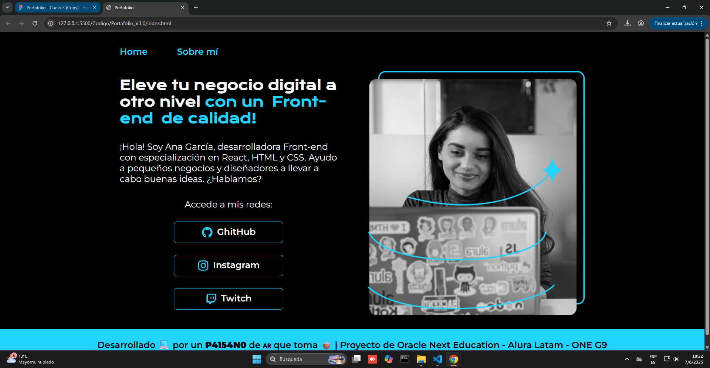
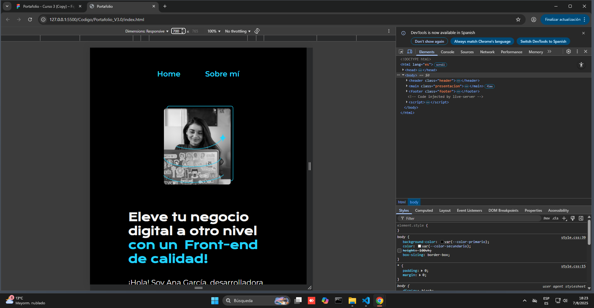
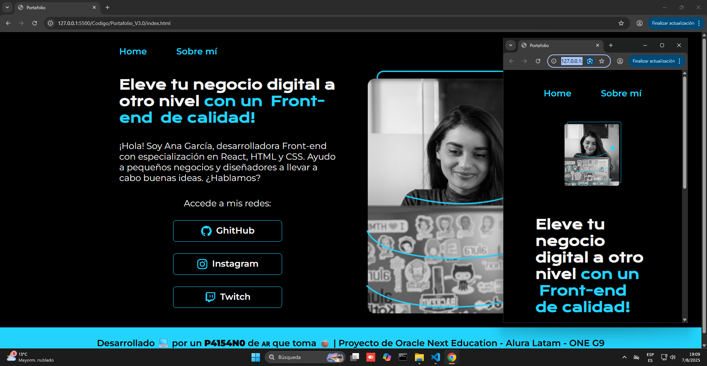

# Portfolio_V3.0_AluraLatam_ONE

Este proyecto es la tercera iteración de mi **Portfolio** personal, la cual incorpora una serie de mejoras clave enfocadas en la **responsividad** y la publicación en línea. Esta versión marca un salto significativo en la adaptación a diferentes dispositivos y la visibilidad del proyecto.

## 🚀 Descripción

En esta **V3.0**, el enfoque principal ha sido en la creación de un diseño que se adapte de manera fluida a distintas pantallas. He implementado las siguientes mejoras:
- **Diseño responsivo** para una visualización óptima en dispositivos móviles, tablets y computadoras de escritorio.
- **Header y footer** con diseño adaptativo.
- Estilización mejorada para una experiencia de usuario más consistente.

El proyecto se basa en un diseño de **Figma** que transformé en código HTML y CSS, centrándome en la adaptabilidad y las buenas prácticas.

A continuación se muestran las comparativas:

**Imagen 1 – Diseño original**


**Imagen 2 – Vista responsiva en herramientas de desarrollador**


**Imagen 2 – Comparación de vista en diferentes anchos de pantalla**


---

## 📚 Contenidos aprendidos en el curso

Durante el desarrollo de esta versión, apliqué los conocimientos adquiridos en el curso de **HTML y CSS** para la responsividad, incluyendo:

- **Cómo hacer el sitio web responsivo** utilizando **Media Queries**.
- **Entendimiento de medidas absolutas y relativas** para un diseño flexible.
- **Uso práctico de GitHub** para almacenar el código en la nube.
- **Publicación del proyecto finalizado** en la web.

---

## 🛠️ Tecnologías utilizadas

- **HTML5** – Estructura y contenido del sitio.
- **CSS3** – Estilos, maquetación y adaptabilidad responsiva.
- **Figma** – Diseño original.

---

## 📂 Estructura del proyecto

```plaintext
Portfolio_v3.0/
│
├── index.html
├── about.html
├── contact.html
├── css/
│   └── style.css
├── proyecto_figma/
│   ├── version_web_v3_img1.png
│   ├── version_web_v3_img2.png
│   └── version_web_v3_img3.png
└── README.md
